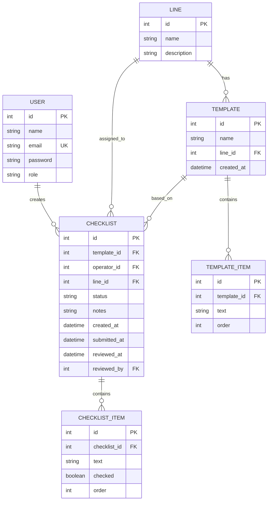
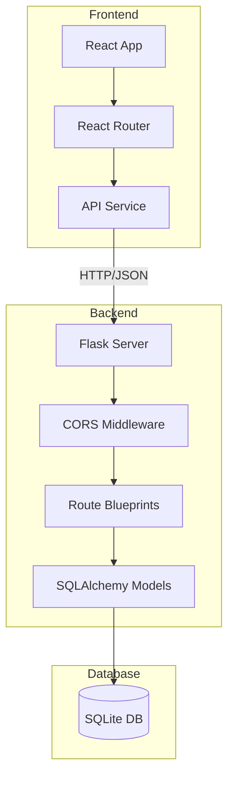
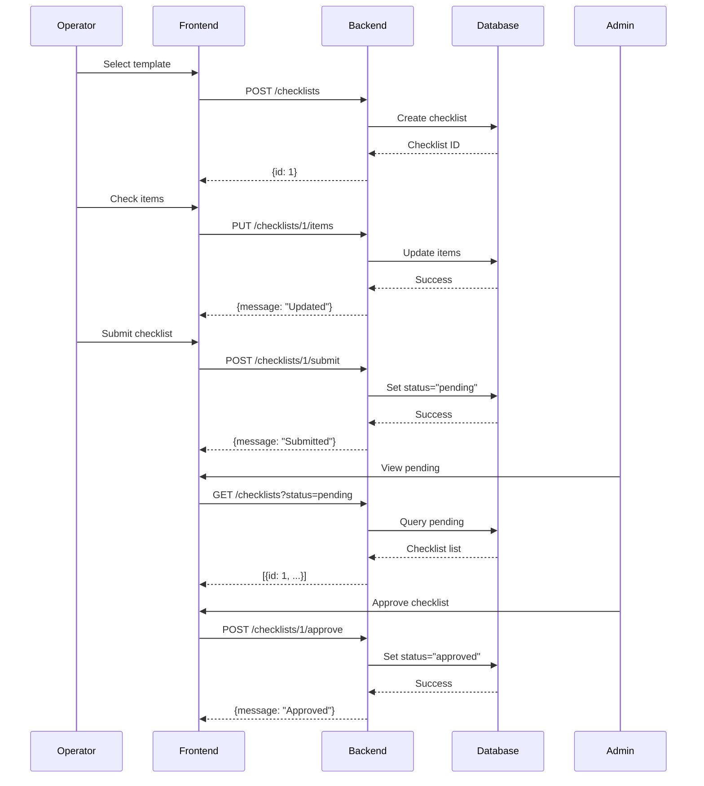
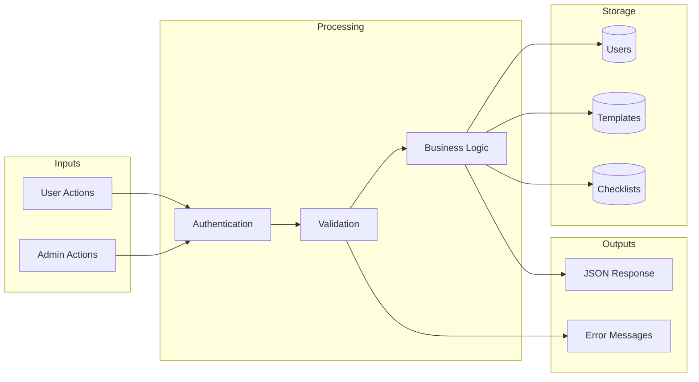

# Technical Blueprints: Back-End

## Overview

This document defines the database schema, API endpoints, and system architecture for the Checklist Management System built with Flask and SQLite.

---

## Database Schema (ERD)

### Entity-Relationship Diagram



---

### Table Definitions

#### User
| Column | Type | Constraints | Description |
|--------|------|-------------|-------------|
| id | INTEGER | PRIMARY KEY, AUTO INCREMENT | Unique identifier |
| name | VARCHAR(120) | NOT NULL | User's display name |
| email | VARCHAR(120) | UNIQUE, NOT NULL | Login email |
| password | VARCHAR(256) | NOT NULL | Hashed password |
| role | VARCHAR(20) | NOT NULL | "operator" or "admin" |

#### Line
| Column | Type | Constraints | Description |
|--------|------|-------------|-------------|
| id | INTEGER | PRIMARY KEY, AUTO INCREMENT | Unique identifier |
| name | VARCHAR(100) | NOT NULL | Production line name |
| description | TEXT | NULLABLE | Line description |

#### Template
| Column | Type | Constraints | Description |
|--------|------|-------------|-------------|
| id | INTEGER | PRIMARY KEY, AUTO INCREMENT | Unique identifier |
| name | VARCHAR(200) | NOT NULL | Template name |
| line_id | INTEGER | FOREIGN KEY (Line.id) | Associated line |
| created_at | DATETIME | DEFAULT NOW | Creation timestamp |

#### TemplateItem
| Column | Type | Constraints | Description |
|--------|------|-------------|-------------|
| id | INTEGER | PRIMARY KEY, AUTO INCREMENT | Unique identifier |
| template_id | INTEGER | FOREIGN KEY (Template.id) | Parent template |
| text | VARCHAR(500) | NOT NULL | Checklist item text |
| order | INTEGER | NOT NULL | Display order |

#### Checklist
| Column | Type | Constraints | Description |
|--------|------|-------------|-------------|
| id | INTEGER | PRIMARY KEY, AUTO INCREMENT | Unique identifier |
| template_id | INTEGER | FOREIGN KEY (Template.id) | Source template |
| operator_id | INTEGER | FOREIGN KEY (User.id) | Assigned operator |
| line_id | INTEGER | FOREIGN KEY (Line.id) | Target line |
| status | VARCHAR(20) | NOT NULL | draft/pending/approved/denied |
| notes | TEXT | NULLABLE | Additional notes |
| created_at | DATETIME | DEFAULT NOW | Creation time |
| submitted_at | DATETIME | NULLABLE | Submission time |
| reviewed_at | DATETIME | NULLABLE | Review time |
| reviewed_by | INTEGER | FOREIGN KEY (User.id), NULLABLE | Reviewing admin |

#### ChecklistItem
| Column | Type | Constraints | Description |
|--------|------|-------------|-------------|
| id | INTEGER | PRIMARY KEY, AUTO INCREMENT | Unique identifier |
| checklist_id | INTEGER | FOREIGN KEY (Checklist.id) | Parent checklist |
| text | VARCHAR(500) | NOT NULL | Item text |
| checked | BOOLEAN | DEFAULT FALSE | Completion status |
| order | INTEGER | NOT NULL | Display order |

---

### Relationships & Cardinality

| Relationship | Cardinality | Description |
|--------------|-------------|-------------|
| User → Checklist | 1:N | One user creates many checklists |
| Line → Template | 1:N | One line has many templates |
| Line → Checklist | 1:N | One line has many checklists |
| Template → TemplateItem | 1:N | One template has many items |
| Template → Checklist | 1:N | One template spawns many checklists |
| Checklist → ChecklistItem | 1:N | One checklist has many items |

---

## API Specification

### Base URL
```
http://localhost:5000/api
```

### Authentication

#### POST /auth/login
Login and receive user session.

**Request:**
```json
{
  "email": "user@example.com",
  "password": "password123"
}
```

**Response (200):**
```json
{
  "user": {
    "id": 1,
    "name": "John Doe",
    "email": "user@example.com",
    "role": "operator"
  }
}
```

**Error (401):**
```json
{
  "error": "Invalid credentials"
}
```

#### GET /auth/me
Get current logged-in user.

**Response (200):**
```json
{
  "id": 1,
  "name": "John Doe",
  "email": "user@example.com",
  "role": "operator"
}
```

---

### Users (Admin only)

#### GET /users
List all users.

**Response (200):**
```json
[
  {
    "id": 1,
    "name": "John Doe",
    "email": "john@example.com",
    "role": "operator"
  }
]
```

#### POST /users
Create new user.

**Request:**
```json
{
  "name": "Jane Smith",
  "email": "jane@example.com",
  "password": "password123",
  "role": "operator"
}
```

**Response (201):**
```json
{
  "id": 2,
  "name": "Jane Smith",
  "email": "jane@example.com",
  "role": "operator"
}
```

#### PUT /users/:id
Update user role.

**Request:**
```json
{
  "role": "admin"
}
```

**Response (200):**
```json
{
  "message": "User updated successfully"
}
```

#### DELETE /users/:id
Delete user.

**Response (200):**
```json
{
  "message": "User deleted successfully"
}
```

---

### Lines

#### GET /lines
List all production lines.

**Response (200):**
```json
[
  {
    "id": 1,
    "name": "Line A - Assembly",
    "description": "Main assembly line"
  }
]
```

---

### Templates

#### GET /templates
List all templates.

**Response (200):**
```json
[
  {
    "id": 1,
    "name": "Daily Safety Check",
    "line_id": 1,
    "line_name": "Line A",
    "item_count": 10,
    "created_at": "2024-01-15T10:30:00Z"
  }
]
```

#### GET /templates/:id
Get template with items.

**Response (200):**
```json
{
  "id": 1,
  "name": "Daily Safety Check",
  "line_id": 1,
  "items": [
    {"id": 1, "text": "Emergency exits clear", "order": 1},
    {"id": 2, "text": "Fire extinguishers in place", "order": 2}
  ]
}
```

#### POST /templates
Create new template (Admin only).

**Request:**
```json
{
  "name": "Weekly Review",
  "line_id": 1,
  "items": [
    {"text": "Check equipment", "order": 1},
    {"text": "Review logs", "order": 2}
  ]
}
```

**Response (201):**
```json
{
  "id": 2,
  "name": "Weekly Review",
  "message": "Template created successfully"
}
```

#### DELETE /templates/:id
Delete template (Admin only).

**Response (200):**
```json
{
  "message": "Template deleted successfully"
}
```

---

### Checklists

#### GET /checklists
List checklists with optional filters.

**Query Parameters:**
- `status`: filter by status (draft/pending/approved/denied)
- `operator_id`: filter by operator
- `line_id`: filter by line

**Response (200):**
```json
[
  {
    "id": 1,
    "template_name": "Daily Safety Check",
    "line_name": "Line A",
    "operator_name": "John Doe",
    "status": "pending",
    "created_at": "2024-01-20T08:00:00Z",
    "submitted_at": "2024-01-20T09:30:00Z"
  }
]
```

#### GET /checklists/:id
Get checklist with items.

**Response (200):**
```json
{
  "id": 1,
  "template_id": 1,
  "template_name": "Daily Safety Check",
  "operator": {"id": 1, "name": "John Doe"},
  "line": {"id": 1, "name": "Line A"},
  "status": "pending",
  "notes": "All clear",
  "items": [
    {"id": 1, "text": "Emergency exits clear", "checked": true, "order": 1},
    {"id": 2, "text": "Fire extinguishers in place", "checked": true, "order": 2}
  ],
  "created_at": "2024-01-20T08:00:00Z",
  "submitted_at": "2024-01-20T09:30:00Z"
}
```

#### POST /checklists
Create new checklist from template.

**Request:**
```json
{
  "template_id": 1,
  "line_id": 1
}
```

**Response (201):**
```json
{
  "id": 1,
  "message": "Checklist created successfully"
}
```

#### PUT /checklists/:id/items
Update checklist items.

**Request:**
```json
{
  "items": [
    {"id": 1, "checked": true},
    {"id": 2, "checked": false}
  ]
}
```

**Response (200):**
```json
{
  "message": "Items updated successfully"
}
```

#### POST /checklists/:id/submit
Submit checklist for approval.

**Response (200):**
```json
{
  "message": "Checklist submitted for approval"
}
```

#### POST /checklists/:id/approve
Approve checklist (Admin only).

**Response (200):**
```json
{
  "message": "Checklist approved"
}
```

#### POST /checklists/:id/deny
Deny checklist (Admin only).

**Response (200):**
```json
{
  "message": "Checklist denied"
}
```

#### DELETE /checklists/:id
Delete checklist.

**Response (200):**
```json
{
  "message": "Checklist deleted successfully"
}
```

---

## System Architecture

### Component Diagram



---

### Sequence Diagram: Checklist Submission Flow



---

### Data Flow Diagram



---

## Technology Stack

| Layer | Technology | Purpose |
|-------|------------|---------|
| Frontend | React 19 | UI Components |
| Routing | React Router 7 | Client-side navigation |
| Backend | Flask 3.x | REST API server |
| ORM | Flask-SQLAlchemy | Database abstraction |
| Database | SQLite | Data persistence |
| CORS | Flask-CORS | Cross-origin requests |

---

## Error Codes

| Status Code | Description | Example |
|-------------|-------------|---------|
| 200 | Success | GET request successful |
| 201 | Created | Resource created |
| 400 | Bad Request | Invalid input data |
| 401 | Unauthorized | Invalid credentials |
| 403 | Forbidden | Insufficient permissions |
| 404 | Not Found | Resource doesn't exist |
| 500 | Server Error | Internal error |
