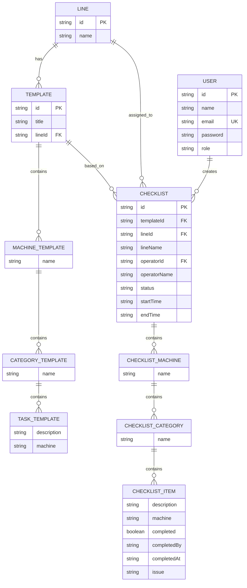
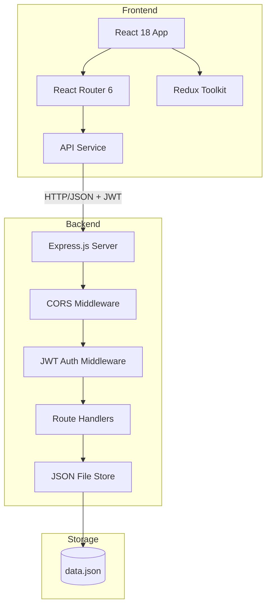
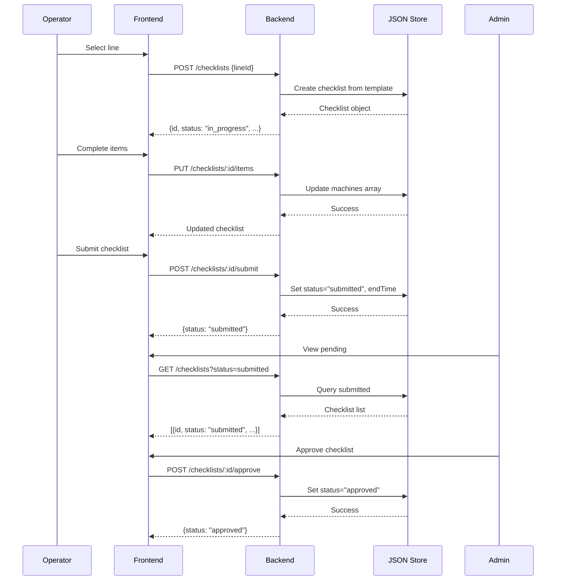
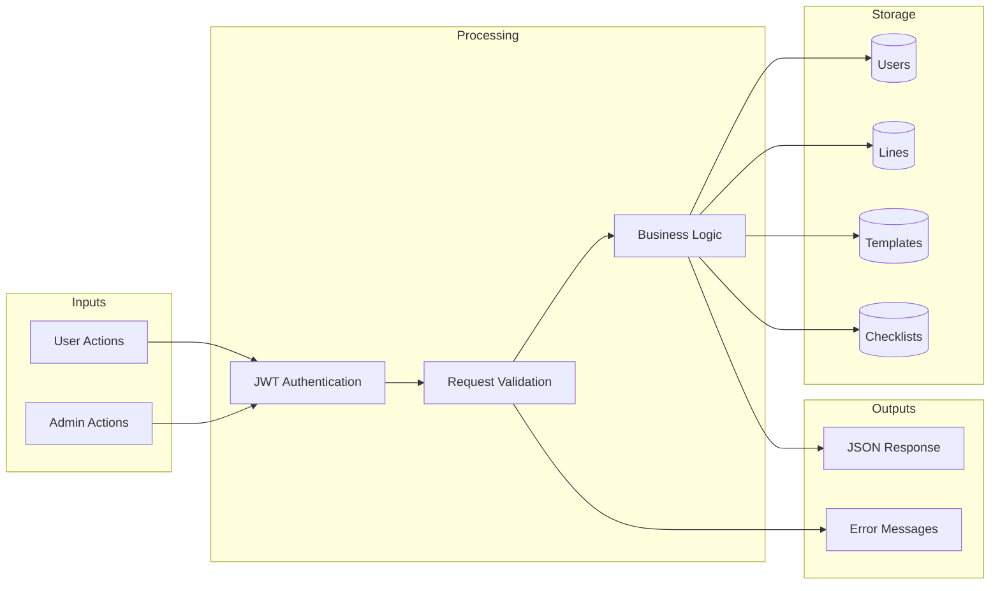

# Technical Blueprints: Back-End

## Overview

This document defines the data models, API endpoints, and system architecture for the Checklist Management System built with Express.js (TypeScript) and JSON file storage.

---

## Data Models

### Entity-Relationship Diagram


```mermaid
erDiagram
    USER ||--o{ CHECKLIST : creates
    USER {
        string id PK
        string name
        string email UK
        string password
        string role
    }

    LINE ||--o{ TEMPLATE : has
    LINE ||--o{ CHECKLIST : assigned_to
    LINE {
        string id PK
        string name
    }

    TEMPLATE ||--o{ MACHINE_TEMPLATE : contains
    TEMPLATE ||--o{ CHECKLIST : based_on
    TEMPLATE {
        string id PK
        string title
        string lineId FK
    }

    MACHINE_TEMPLATE ||--o{ CATEGORY_TEMPLATE : contains
    MACHINE_TEMPLATE {
        string name
    }

    CATEGORY_TEMPLATE ||--o{ TASK_TEMPLATE : contains
    CATEGORY_TEMPLATE {
        string name
    }

    TASK_TEMPLATE {
        string description
        string machine
    }

    CHECKLIST ||--o{ CHECKLIST_MACHINE : contains
    CHECKLIST {
        string id PK
        string templateId FK
        string lineId FK
        string lineName
        string operatorId FK
        string operatorName
        string status
        string startTime
        string endTime
    }

    CHECKLIST_MACHINE ||--o{ CHECKLIST_CATEGORY : contains
    CHECKLIST_MACHINE {
        string name
    }

    CHECKLIST_CATEGORY ||--o{ CHECKLIST_ITEM : contains
    CHECKLIST_CATEGORY {
        string name
    }

    CHECKLIST_ITEM {
        string description
        string machine
        boolean completed
        string completedBy
        string completedAt
        string issue
    }
```

---

### TypeScript Interfaces

#### User
```typescript
interface User {
  id: string;
  name: string;
  email: string;
  password: string;
  role: 'operator' | 'admin';
}
```

#### Line
```typescript
interface Line {
  id: string;
  name: string;
}
```

#### Template
```typescript
interface TaskTemplate {
  description: string;
  machine: string | null;
}

interface CategoryTemplate {
  name: string;
  tasks: TaskTemplate[];
}

interface MachineTemplate {
  name: string;
  categories: CategoryTemplate[];
}

interface Template {
  id: string;
  title: string;
  lineId: string;
  machines: MachineTemplate[];
}
```

#### Checklist
```typescript
interface ChecklistItem {
  description: string;
  machine: string | null;
  completed: boolean | null;
  completedBy: string | null;
  completedAt: string | null;
  issue: string | null;
}

interface ChecklistCategory {
  name: string;
  items: ChecklistItem[];
}

interface ChecklistMachine {
  name: string;
  categories: ChecklistCategory[];
}

interface Checklist {
  id: string;
  templateId: string;
  lineId: string;
  lineName: string;
  operatorId: string;
  operatorName: string;
  status: 'in_progress' | 'submitted' | 'approved' | 'denied';
  startTime: string;
  endTime: string | null;
  machines: ChecklistMachine[];
}
```

---

### Relationships & Cardinality

| Relationship | Cardinality | Description |
|--------------|-------------|-------------|
| User → Checklist | 1:N | One user creates many checklists |
| Line → Template | 1:N | One line has many templates |
| Line → Checklist | 1:N | One line has many checklists |
| Template → MachineTemplate | 1:N | One template has many machines |
| MachineTemplate → CategoryTemplate | 1:N | One machine has many categories |
| CategoryTemplate → TaskTemplate | 1:N | One category has many tasks |
| Template → Checklist | 1:N | One template spawns many checklists |
| Checklist → ChecklistMachine | 1:N | One checklist has many machines |

---

## API Specification

### Base URL
```
http://localhost:5001/api
```

### Authentication

All endpoints except `/auth/login` require a Bearer token in the Authorization header:
```
Authorization: Bearer <jwt_token>
```

#### POST /auth/login
Login and receive JWT token.

**Request:**
```json
{
  "email": "user@example.com",
  "password": "password123"
}
```

**Response (200):**
```json
{
  "user": {
    "id": "uuid",
    "name": "John Doe",
    "email": "user@example.com",
    "role": "operator"
  },
  "token": "jwt_token_here"
}
```

**Error (401):**
```json
{
  "error": "Invalid credentials"
}
```

#### GET /auth/me
Get current logged-in user.

**Response (200):**
```json
{
  "id": "uuid",
  "name": "John Doe",
  "email": "user@example.com",
  "role": "operator"
}
```

---

### Users (Admin only for mutations)

#### GET /users
List all users (passwords excluded).

**Response (200):**
```json
[
  {
    "id": "uuid",
    "name": "John Doe",
    "email": "john@example.com",
    "role": "operator"
  }
]
```

#### POST /users
Create new user. (Admin only)

**Request:**
```json
{
  "name": "Jane Smith",
  "email": "jane@example.com",
  "password": "password123",
  "role": "operator"
}
```

**Response (201):**
```json
{
  "id": "uuid",
  "name": "Jane Smith",
  "email": "jane@example.com",
  "role": "operator"
}
```

#### PUT /users/:id
Update user role. (Admin only)

**Request:**
```json
{
  "role": "admin"
}
```

**Response (200):**
```json
{
  "id": "uuid",
  "name": "Jane Smith",
  "email": "jane@example.com",
  "role": "admin"
}
```

#### DELETE /users/:id
Delete user. (Admin only)

**Response (204):** No content

---

### Lines

#### GET /lines
List all production lines.

**Response (200):**
```json
[
  {
    "id": "uuid",
    "name": "Line A - Assembly"
  }
]
```

---

### Templates

#### GET /templates
List all templates.

**Response (200):**
```json
[
  {
    "id": "uuid",
    "title": "Daily Safety Check",
    "lineId": "line-uuid",
    "machines": [
      {
        "name": "Machine 1",
        "categories": [
          {
            "name": "Safety",
            "tasks": [
              {"description": "Check emergency stops", "machine": null}
            ]
          }
        ]
      }
    ]
  }
]
```

#### GET /templates/:id
Get template by ID.

**Response (200):**
```json
{
  "id": "uuid",
  "title": "Daily Safety Check",
  "lineId": "line-uuid",
  "machines": [...]
}
```

#### POST /templates
Create new template. (Admin only)

**Request:**
```json
{
  "title": "Weekly Review",
  "lineId": "line-uuid",
  "machines": [
    {
      "name": "Machine 1",
      "categories": [
        {
          "name": "Maintenance",
          "tasks": [
            {"description": "Check oil levels", "machine": null}
          ]
        }
      ]
    }
  ]
}
```

**Response (201):**
```json
{
  "id": "uuid",
  "title": "Weekly Review",
  "lineId": "line-uuid",
  "machines": [...]
}
```

#### DELETE /templates/:id
Delete template. (Admin only)

**Response (204):** No content

---

### Checklists

#### GET /checklists
List checklists with optional filters.

**Query Parameters:**
- `status`: filter by status (in_progress/submitted/approved/denied)
- `operatorId`: filter by operator
- `lineId`: filter by line

**Response (200):**
```json
[
  {
    "id": "uuid",
    "templateId": "template-uuid",
    "lineId": "line-uuid",
    "lineName": "Line A",
    "operatorId": "user-uuid",
    "operatorName": "John Doe",
    "status": "submitted",
    "startTime": "2024-01-20T08:00:00.000Z",
    "endTime": "2024-01-20T09:30:00.000Z",
    "machines": [...]
  }
]
```

#### GET /checklists/:id
Get checklist by ID.

**Response (200):**
```json
{
  "id": "uuid",
  "templateId": "template-uuid",
  "lineId": "line-uuid",
  "lineName": "Line A",
  "operatorId": "user-uuid",
  "operatorName": "John Doe",
  "status": "in_progress",
  "startTime": "2024-01-20T08:00:00.000Z",
  "endTime": null,
  "machines": [
    {
      "name": "Machine 1",
      "categories": [
        {
          "name": "Safety",
          "items": [
            {
              "description": "Check emergency stops",
              "machine": null,
              "completed": true,
              "completedBy": "John Doe",
              "completedAt": "2024-01-20T08:15:00.000Z",
              "issue": null
            }
          ]
        }
      ]
    }
  ]
}
```

#### POST /checklists
Create new checklist from template.

**Request:**
```json
{
  "lineId": "line-uuid"
}
```

**Response (201):**
```json
{
  "id": "uuid",
  "templateId": "template-uuid",
  "lineId": "line-uuid",
  "lineName": "Line A",
  "operatorId": "user-uuid",
  "operatorName": "John Doe",
  "status": "in_progress",
  "startTime": "2024-01-20T08:00:00.000Z",
  "endTime": null,
  "machines": [...]
}
```

#### PUT /checklists/:id/items
Update checklist items (machines array).

**Request:**
```json
{
  "machines": [
    {
      "name": "Machine 1",
      "categories": [
        {
          "name": "Safety",
          "items": [
            {
              "description": "Check emergency stops",
              "machine": null,
              "completed": true,
              "completedBy": "John Doe",
              "completedAt": "2024-01-20T08:15:00.000Z",
              "issue": null
            }
          ]
        }
      ]
    }
  ]
}
```

**Response (200):** Updated checklist object

#### POST /checklists/:id/submit
Submit checklist for approval.

**Response (200):**
```json
{
  "id": "uuid",
  "status": "submitted",
  "endTime": "2024-01-20T09:30:00.000Z",
  ...
}
```

#### POST /checklists/:id/approve
Approve checklist. (Admin only)

**Response (200):**
```json
{
  "id": "uuid",
  "status": "approved",
  ...
}
```

#### POST /checklists/:id/deny
Deny checklist. (Admin only)

**Response (200):**
```json
{
  "id": "uuid",
  "status": "denied",
  ...
}
```

#### DELETE /checklists/:id
Delete checklist.

**Response (204):** No content

---

## System Architecture

### Component Diagram


```mermaid
graph TB
    subgraph Frontend
        React[React 18 App]
        Router[React Router 6]
        Redux[Redux Toolkit]
        API_Client[API Service]
    end

    subgraph Backend
        Express[Express.js Server]
        CORS[CORS Middleware]
        Auth[JWT Auth Middleware]
        Routes[Route Handlers]
        Store[JSON File Store]
    end

    subgraph Storage
        JSON[(data.json)]
    end

    React --> Router
    React --> Redux
    Router --> API_Client
    API_Client -->|HTTP/JSON + JWT| Express
    Express --> CORS
    CORS --> Auth
    Auth --> Routes
    Routes --> Store
    Store --> JSON
```

---

### Sequence Diagram: Checklist Submission Flow


```mermaid
sequenceDiagram
    participant O as Operator
    participant F as Frontend
    participant B as Backend
    participant S as JSON Store
    participant A as Admin

    O->>F: Select line
    F->>B: POST /checklists {lineId}
    B->>S: Create checklist from template
    S-->>B: Checklist object
    B-->>F: {id, status: "in_progress", ...}

    O->>F: Complete items
    F->>B: PUT /checklists/:id/items
    B->>S: Update machines array
    S-->>B: Success
    B-->>F: Updated checklist

    O->>F: Submit checklist
    F->>B: POST /checklists/:id/submit
    B->>S: Set status="submitted", endTime
    S-->>B: Success
    B-->>F: {status: "submitted"}

    A->>F: View pending
    F->>B: GET /checklists?status=submitted
    B->>S: Query submitted
    S-->>B: Checklist list
    B-->>F: [{id, status: "submitted", ...}]

    A->>F: Approve checklist
    F->>B: POST /checklists/:id/approve
    B->>S: Set status="approved"
    S-->>B: Success
    B-->>F: {status: "approved"}
```

---

### Data Flow Diagram


```mermaid
flowchart LR
    subgraph Inputs
        User[User Actions]
        Admin[Admin Actions]
    end

    subgraph Processing
        Auth[JWT Authentication]
        Valid[Request Validation]
        Logic[Business Logic]
    end

    subgraph Storage
        Users[(Users)]
        Lines[(Lines)]
        Templates[(Templates)]
        Checklists[(Checklists)]
    end

    subgraph Outputs
        JSON[JSON Response]
        Error[Error Messages]
    end

    User --> Auth
    Admin --> Auth
    Auth --> Valid
    Valid --> Logic
    Logic --> Users
    Logic --> Lines
    Logic --> Templates
    Logic --> Checklists
    Logic --> JSON
    Valid --> Error
```

---

## Technology Stack

| Layer | Technology | Version | Purpose |
|-------|------------|---------|---------|
| Frontend | React | 18.3 | UI Components |
| State Management | Redux Toolkit | 2.5 | Global state |
| Routing | React Router | 6.28 | Client-side navigation |
| Build Tool | Vite | 7.3 | Development & bundling |
| Backend | Express.js | 4.21 | REST API server |
| Language | TypeScript | 5.7 | Type safety |
| Authentication | jsonwebtoken | 9.0 | JWT tokens |
| IDs | uuid | 11.1 | Unique identifiers |
| Storage | JSON File | - | Data persistence |
| Testing | Vitest | 3.0 | Unit tests |

---

## Error Codes

| Status Code | Description | Example |
|-------------|-------------|---------|
| 200 | Success | GET/PUT request successful |
| 201 | Created | Resource created |
| 204 | No Content | DELETE successful |
| 400 | Bad Request | Missing required fields |
| 401 | Unauthorized | Invalid/missing JWT token |
| 403 | Forbidden | Admin access required |
| 404 | Not Found | Resource doesn't exist |
| 409 | Conflict | Email already exists |

---

## Project Structure

```
packages/
├── backend/
│   ├── src/
│   │   ├── config/
│   │   │   └── env.ts          # Environment config
│   │   ├── data/
│   │   │   ├── seed.ts         # Seed data
│   │   │   └── store.ts        # JSON file store
│   │   ├── middleware/
│   │   │   └── auth.ts         # JWT auth middleware
│   │   ├── routes/
│   │   │   ├── auth.ts         # Auth endpoints
│   │   │   ├── checklists.ts   # Checklist CRUD
│   │   │   ├── lines.ts        # Lines endpoint
│   │   │   ├── templates.ts    # Template CRUD
│   │   │   └── users.ts        # User CRUD
│   │   ├── types/
│   │   │   └── index.ts        # TypeScript interfaces
│   │   └── index.ts            # Express app entry
│   ├── data.json               # Persistent data store
│   └── package.json
├── frontend/
│   ├── src/
│   │   ├── components/         # Shared components
│   │   ├── pages/              # Page components
│   │   ├── services/
│   │   │   └── api.ts          # API client
│   │   ├── store/              # Redux store
│   │   ├── App.tsx
│   │   └── main.tsx
│   └── package.json
└── package.json                # Monorepo root
```
